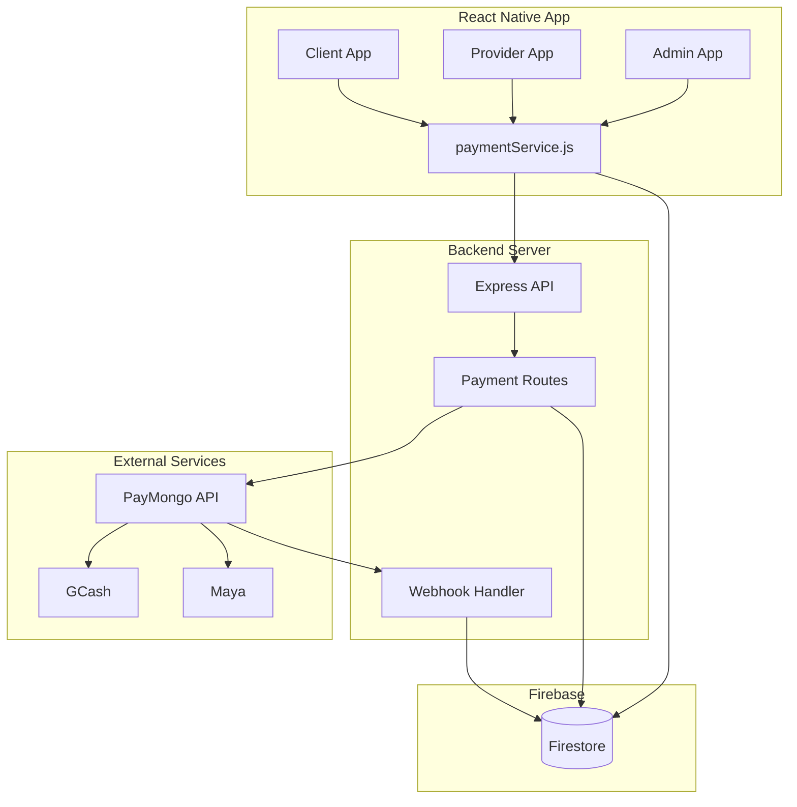

# Design Document: PayMongo Payment Integration

## Overview

This design document outlines the architecture and implementation details for integrating PayMongo payment gateway into the service booking application. The integration enables clients to pay via GCash and Maya e-wallets, with funds collected into the platform's PayMongo account. Providers can request payouts to their linked e-wallet accounts, and admins can manage platform earnings and process payouts.

The system builds upon existing infrastructure:
- Backend Express server with PayMongo routes (`backend/routes/payments.js`)
- Frontend payment service (`src/services/paymentService.js`)
- Wallet screen for providers (`src/screens/payment/WalletScreen.jsx`)
- Job completion flow with `pending_payment` status

## Architecture



## Components and Interfaces

### 1. Payment Flow Component (Client Side)

**File:** `src/screens/client/JobDetailsScreen.jsx`

Updates to `handleMakePayment` function:

```javascript
interface PaymentOptions {
  bookingId: string;
  amount: number;
  userId: string;
  providerId: string;
  description: string;
}

interface PaymentResult {
  success: boolean;
  checkoutUrl?: string;
  sourceId?: string;
  error?: string;
}
```

**Flow:**
1. Display payment method selection modal (GCash, Maya, Cash)
2. For e-wallet: Call `paymentService.createGCashPayment()` or `createPayMayaPayment()`
3. Open checkout URL in browser via `Linking.openURL()`
4. Listen for app resume and check payment status
5. Update UI based on payment result

### 2. Payment Service (Frontend)

**File:** `src/services/paymentService.js`

Existing service with enhancements:

```javascript
interface PaymentService {
  // Existing methods (already implemented)
  createGCashPayment(bookingId, userId, amount, description): Promise<PaymentResult>;
  createPayMayaPayment(bookingId, userId, amount, description): Promise<PaymentResult>;
  openPaymentCheckout(checkoutUrl): Promise<{success: boolean}>;
  checkPaymentStatus(bookingId): Promise<PaymentStatus>;
  recordCashPayment(bookingId, userId, amount, providerId): Promise<{success: boolean}>;
  
  // New methods to add
  pollPaymentStatus(bookingId, maxAttempts): Promise<PaymentStatus>;
  getProviderBalance(providerId): Promise<BalanceInfo>;
  requestPayout(providerId, amount, accountDetails): Promise<PayoutResult>;
  getPayoutHistory(providerId): Promise<Payout[]>;
  getAdminEarnings(startDate, endDate): Promise<AdminEarnings>;
}
```

### 3. Backend Payment Routes

**File:** `backend/routes/payments.js`

Existing routes with enhancements:

| Endpoint | Method | Description |
|----------|--------|-------------|
| `/create-gcash-source` | POST | Create GCash payment source (exists) |
| `/create-paymaya-source` | POST | Create Maya payment source (exists) |
| `/create-payment` | POST | Create payment from source (exists) |
| `/webhook` | POST | Handle PayMongo webhooks (exists, needs enhancement) |
| `/payment-status/:bookingId` | GET | Check payment status (exists) |
| `/provider-balance/:providerId` | GET | Get provider balance (new) |
| `/request-payout` | POST | Request provider payout (new) |
| `/payout-history/:providerId` | GET | Get payout history (new) |
| `/admin/earnings` | GET | Get admin earnings summary (new) |
| `/admin/payouts` | GET | List pending payouts (new) |
| `/admin/approve-payout/:payoutId` | POST | Approve payout (new) |

### 4. Webhook Handler Enhancement

**File:** `backend/routes/payments.js`

Enhanced webhook handling with signature verification:

```javascript
// Webhook event types to handle
const WEBHOOK_EVENTS = {
  SOURCE_CHARGEABLE: 'source.chargeable',
  PAYMENT_PAID: 'payment.paid',
  PAYMENT_FAILED: 'payment.failed',
};

// Webhook processing flow
1. Verify signature using PayMongo webhook secret
2. Check for duplicate events (idempotency)
3. Process based on event type
4. Update Firestore documents
5. Trigger notifications
```

### 5. Wallet Screen Enhancement

**File:** `src/screens/payment/WalletScreen.jsx`

Current implementation is mostly complete. Enhancements needed:
- Real-time balance updates via Firestore listener
- Payout history section
- Transaction details modal

### 6. Admin Earnings Dashboard

**File:** `src/screens/admin/AdminEarningsScreen.jsx`

New/enhanced screen for admin earnings management:

```javascript
interface AdminEarningsData {
  totalRevenue: number;
  totalCommission: number;
  pendingPayouts: number;
  completedPayouts: number;
  recentTransactions: Transaction[];
  pendingPayoutRequests: PayoutRequest[];
}
```

## Data Models

### Firestore Collections

#### `payments` Collection
```javascript
{
  id: string,                    // Document ID (sourceId)
  sourceId: string,              // PayMongo source ID
  paymentId: string,             // PayMongo payment ID (after payment)
  bookingId: string,             // Reference to booking
  userId: string,                // Client who paid
  providerId: string,            // Provider receiving payment
  amount: number,                // Payment amount in PHP
  type: 'gcash' | 'paymaya' | 'cash',
  status: 'pending' | 'paid' | 'failed' | 'refunded',
  checkoutUrl: string,           // PayMongo checkout URL
  createdAt: Timestamp,
  paidAt: Timestamp,
  failedAt: Timestamp,
  webhookProcessed: boolean,     // Idempotency flag
}
```

#### `transactions` Collection
```javascript
{
  id: string,
  bookingId: string,
  clientId: string,
  providerId: string,
  type: 'payment' | 'payout' | 'refund' | 'commission',
  amount: number,
  paymentId: string,
  paymentMethod: string,
  status: 'pending' | 'completed' | 'failed',
  providerShare: number,         // 95% of amount
  platformCommission: number,    // 5% of amount
  createdAt: Timestamp,
}
```

#### `payouts` Collection
```javascript
{
  id: string,
  providerId: string,
  amount: number,
  accountMethod: 'gcash' | 'maya',
  accountNumber: string,
  accountName: string,
  status: 'pending' | 'approved' | 'processing' | 'completed' | 'failed',
  transactionIds: string[],      // Jobs included in payout
  requestedAt: Timestamp,
  approvedAt: Timestamp,
  approvedBy: string,            // Admin ID
  completedAt: Timestamp,
  failureReason: string,
}
```

#### `users` Collection (Provider fields)
```javascript
{
  // Existing fields...
  payoutAccount: {
    method: 'gcash' | 'maya',
    accountNumber: string,
    accountName: string,
    updatedAt: Timestamp,
  },
  availableBalance: number,      // Can be withdrawn
  pendingBalance: number,        // From incomplete jobs
  totalEarnings: number,         // Lifetime earnings
  totalPayouts: number,          // Lifetime payouts
}
```

## Correctness Properties

*A property is a characteristic or behavior that should hold true across all valid executions of a system-essentially, a formal statement about what the system should do. Properties serve as the bridge between human-readable specifications and machine-verifiable correctness guarantees.*

### Property 1: Provider share calculation
*For any* payment amount, the provider's share SHALL be exactly 95% of the total amount (amount * 0.95).
**Validates: Requirements 2.2, 3.2**

### Property 2: Platform commission calculation
*For any* payment amount, the platform commission SHALL be exactly 5% of the total amount (amount * 0.05).
**Validates: Requirements 3.2**

### Property 3: Minimum payout validation
*For any* payout request with amount less than 100, the system SHALL reject the request and return an error.
**Validates: Requirements 2.3**

### Property 4: Webhook idempotency
*For any* webhook event ID, processing the same event multiple times SHALL result in exactly one database update.
**Validates: Requirements 7.3**

### Property 5: Balance consistency after payout
*For any* successful payout of amount X, the provider's available balance SHALL decrease by exactly X.
**Validates: Requirements 2.4**

### Property 6: Transaction record completeness
*For any* completed payment, the transaction record SHALL contain all required fields: bookingId, clientId, providerId, amount, paymentMethod, status, providerShare, platformCommission, and createdAt.
**Validates: Requirements 1.4, 5.1**

### Property 7: Payment status transitions
*For any* payment, the status SHALL only transition in valid sequences: pending → paid, pending → failed, or paid → refunded.
**Validates: Requirements 4.2, 4.3**

### Property 8: Payout record completeness
*For any* payout request, the record SHALL contain: providerId, amount, accountMethod, accountNumber, status, and requestedAt.
**Validates: Requirements 6.1**

### Property 9: Failed payout balance restoration
*For any* payout that fails after being approved, the provider's available balance SHALL be restored to its pre-payout value.
**Validates: Requirements 7.4**

### Property 10: Booking status after successful payment
*For any* successful payment webhook, the associated booking status SHALL be updated to `payment_received`.
**Validates: Requirements 1.3, 4.5**

## Error Handling

### Payment Errors

| Error Type | Handling |
|------------|----------|
| Network timeout | Show retry button, preserve payment state |
| Invalid amount | Validate before API call, show error message |
| PayMongo API error | Log error, show user-friendly message |
| Checkout cancelled | Keep booking in `pending_payment`, allow retry |
| Duplicate payment | Check existing payments before creating new source |

### Webhook Errors

| Error Type | Handling |
|------------|----------|
| Invalid signature | Reject webhook, log security event |
| Missing booking | Log error, don't crash webhook handler |
| Duplicate event | Skip processing, return 200 OK |
| Database error | Retry with exponential backoff |

### Payout Errors

| Error Type | Handling |
|------------|----------|
| Insufficient balance | Reject request, show current balance |
| Invalid account | Validate account format before submission |
| Processing failure | Restore balance, notify provider |

## Testing Strategy

### Unit Testing

Unit tests will cover:
- Commission and share calculations
- Payout validation logic
- Payment status transitions
- Data model validation

**Framework:** Jest

### Property-Based Testing

Property-based tests will verify the correctness properties using fast-check library.

**Framework:** fast-check (JavaScript property-based testing library)

**Configuration:** Minimum 100 iterations per property test

**Test file location:** `src/__tests__/payment.property.test.js` and `backend/__tests__/payment.property.test.js`

Each property test will be tagged with:
```javascript
// **Feature: paymongo-payment-integration, Property {number}: {property_text}**
```

### Integration Testing

Integration tests will cover:
- End-to-end payment flow with mock PayMongo
- Webhook processing with sample payloads
- Payout request and approval flow

### Manual Testing Checklist

- [ ] GCash payment flow on real device
- [ ] Maya payment flow on real device
- [ ] Cash payment recording
- [ ] Provider payout request
- [ ] Admin payout approval
- [ ] Webhook handling with PayMongo test mode
