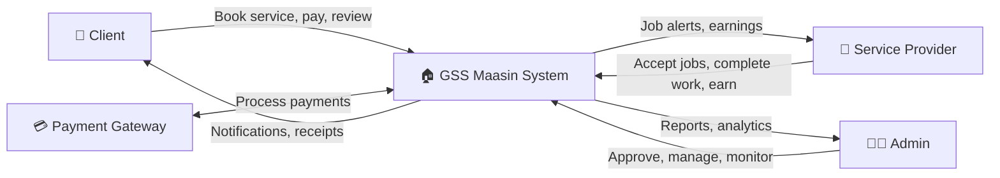
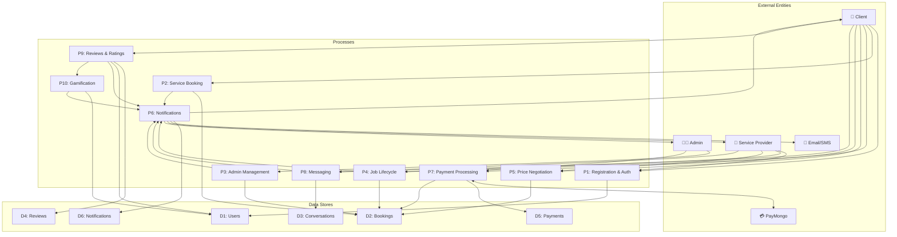

# GSS Maasin — Data Flow Diagram (DFD) Process Documentation

> **General Services System (GSS)** — A digital platform connecting clients in Maasin City with local service providers. Built with React Native (mobile), Next.js (web), Node.js/Express (backend), and Firebase (database/auth).

---

## External Entities

| Entity | Description |
|--------|-------------|
| **Client** | A user who books home services (e.g., plumbing, cleaning) |
| **Service Provider** | A verified professional who performs services |
| **Admin** | System administrator who manages the platform |
| **Payment Gateway** | Third-party payment processor (PayMongo — GCash, Maya, QR Ph) |
| **Firebase** | Cloud database (Firestore) and authentication service |
| **Email/SMS Service** | External service for OTP verification and notifications |

---

## Data Stores

| Store | Description |
|-------|-------------|
| **D1 — Users** | Stores client and provider profiles, credentials, roles, and verification status |
| **D2 — Bookings** | Stores all service bookings/jobs, statuses, pricing, additional charges, and discounts |
| **D3 — Conversations** | Stores chat conversations and messages between users |
| **D4 — Reviews** | Stores ratings, comments, and review images |
| **D5 — Payments** | Stores payment transactions, refunds, and payout records |
| **D6 — Notifications** | Stores push notification records and read statuses |

---

## Context Diagram (Level 0)



---

## Process 1: User Registration and Authentication

### Description
Handles the registration of new clients and service providers, including multi-step identity verification. Providers undergo an additional admin approval step before activation.

### Data Flow
```
Client/Provider → [Registration Data] → P1 → [User Record] → D1 (Users)
P1 → [OTP Request] → Email/SMS Service
Email/SMS Service → [OTP Code] → P1
P1 → [Verification Status] → Client/Provider
Admin → [Approval/Rejection] → P1 → [Updated Status] → D1 (Users)
```

### Detailed Steps
1. **User inputs personal info** — first name, last name, date of birth, email, phone number
2. **Email verification** — system sends OTP via email service; user enters the code
3. **Phone verification** — system sends OTP via SMS; user enters the code
4. **Password creation** — user creates a secure password; stored via Firebase Auth
5. **Location setup** — user selects barangay/address within Maasin City
6. **Profile photo** — user uploads a profile picture
7. **(Provider only) Service category selection** — selects expertise (e.g., Plumbing, Electrical, Cleaning)
8. **(Provider only) Document upload** — uploads valid IDs, certifications, barangay clearance
9. **(Provider only) About service** — describes their experience and services offered
10. **Account creation** — user record is saved to Firestore (`users` collection) with role: `client` or `provider`
11. **(Provider only) Pending approval** — admin reviews the application and approves/rejects

### Key Fields Stored
- `firstName`, `lastName`, `email`, `phone`, `role`, `profilePhoto`
- `address`, `barangay`, `coordinates` (latitude/longitude)
- `serviceCategory`, `documents[]`, `aboutService` (providers)
- `isApproved`, `isVerified`, `emailVerified`, `phoneVerified`
- `createdAt`, `points` (gamification)

---

## Process 2: Service Booking / Job Request

### Description
Allows clients to browse available providers, view their profiles/reviews, and create a service booking request with details like date, time, address, and pricing preferences.

### Data Flow
```
Client → [Service Category, Provider, Schedule, Price] → P2
P2 → [Provider Query] → D1 (Users) → [Provider List] → P2
P2 → [Booking Record] → D2 (Bookings)
P2 → [Notification] → P6 (Notification System)
P2 → [Payment Link] → P7 (Payment Processing) (if "Pay First" selected)
```

### Detailed Steps
1. **Client selects service category** — e.g., Plumbing, Electrical, Cleaning, Carpentry
2. **System displays available providers** — filters by category, location, rating, availability
3. **Client views provider profile** — sees rating, reviews, tier badge, completed jobs, distance
4. **Client fills booking form**:
   - Scheduled date and time
   - Service description/special instructions
   - House number, street, barangay (service location)
   - Reference images (optional)
   - Payment preference: `Pay First (Online)` or `Pay After Service (Cash)`
5. **Price calculation** — base price + 5% system/platform fee = total amount
6. **Booking created** — saved to Firestore with status: `pending`
7. **If Pay First** — client is redirected to payment gateway (Process 7)
8. **Admin notified** — booking goes to admin queue for approval (Process 5)

### Key Fields Stored
- `clientId`, `providerId`, `serviceCategory`, `description`
- `scheduledDate`, `scheduledTime`
- `houseNumber`, `streetAddress`, `barangay`, `coordinates`
- `price` (base), `systemFee`, `totalAmount` (with fee)
- `paymentPreference`: `pay_first` | `pay_after`
- `status`: `pending`, `mediaUrls[]`, `createdAt`

---

## Process 3: Admin Job Management

### Description
Admin reviews, approves, or rejects booking requests. Only after admin approval can providers see and act on job requests. Admin can also manage ongoing jobs and handle disputes.

### Data Flow
```
Admin → [Approve/Reject Decision] → P3
P3 → [Job Query] → D2 (Bookings) → [Pending Jobs] → P3
P3 → [Updated Status] → D2 (Bookings)
P3 → [Approval Notification] → P6 (Notification System) → Provider
P3 → [Rejection Notification + Refund] → Client
```

### Detailed Steps
1. **Admin views pending bookings** — dashboard shows all jobs with status `pending`
2. **Admin reviews job details** — client info, provider info, service type, price, media
3. **Approve** — status changes to `pending` with `adminApproved: true`; provider is notified
4. **Reject** — status changes to `admin_rejected`; client is notified with reason
   - If Pay First: automatic refund is triggered (Process 7)
5. **Admin can monitor all active jobs** — filter by status, date, category
6. **Admin can view analytics** — total revenue, completed jobs, active providers, top categories

### Key Fields Updated
- `adminApproved`: `true`/`false`
- `adminApprovedBy`: admin UID
- `adminApprovalNotes`: optional notes
- `adminApprovedAt`: timestamp
- `status`: `admin_rejected` (if rejected), `refundStatus` (if refund needed)

---

## Process 4: Job Lifecycle Management

### Description
Manages the complete lifecycle of a service job — from provider acceptance through traveling, arrival, work execution, completion, and final confirmation. Includes real-time location tracking.

### Data Flow
```
Provider → [Accept/Decline] → P4
P4 ↔ D2 (Bookings) [Status Updates]
P4 → [Status Notification] → P6 → Client
P4 → [Location Data] → D2 (Bookings) → Client (real-time tracking)
Client → [Confirm Completion] → P4
```

### Job Status Flow (State Machine)
```
pending → (admin approves) → pending [adminApproved=true]
    → Provider accepts → accepted
    → Provider declines → declined
accepted → traveling (provider en route, GPS tracking starts)
traveling → arrived (provider at location)
arrived → in_progress (work has started)
in_progress → pending_completion (provider marks work done)
pending_completion → completed (client confirms) OR → in_progress (client disputes)
completed → payment_received (final)
```

### Detailed Steps
1. **Provider receives job notification** — views job details (client info, location, price)
2. **Accept** — status → `accepted`; client notified; provider can message/call client
3. **Decline** — status → `declined` with reason; booking reassigned or cancelled
4. **Price Negotiation (optional)** — provider sends counter-offer → client accepts/declines/re-counters
5. **Start Traveling** — GPS tracking activates; client sees real-time location on map
6. **Mark Arrived** — status → `arrived`; client gets arrival notification
7. **Start Work** — status → `in_progress`; timer begins tracking active work time
8. **Add Additional Charge (optional)** — provider requests extra charge → sent to client for approval
9. **Offer Discount (optional)** — provider offers discount → price recalculated
10. **Mark Complete** — status → `pending_completion`; client reviews and confirms
11. **Client Confirms** — status → `completed`; payment processing triggered

### Key Fields Updated
- `status` (each state transition)
- `acceptedAt`, `travelingStartedAt`, `arrivedAt`, `startedAt`, `completedAt`
- `providerLocation: { latitude, longitude }` (real-time GPS)
- `workDuration`, `travelDuration`
- `additionalCharges[]`, `discount`, `discountReason`

---

## Process 5: Price Negotiation

### Description
Handles counter-offers between providers and clients when the provider suggests a different price. Supports multiple rounds of negotiation until both parties agree or the job is cancelled.

### Data Flow
```
Provider → [Counter Price + Note] → P5
P5 → [Updated Booking] → D2 (Bookings)
P5 → [Counter Offer Notification] → P6 → Client
Client → [Accept/Decline/New Offer] → P5
P5 → [Final Price] → D2 (Bookings)
```

### Detailed Steps
1. **Provider views booking** — sees client's proposed price
2. **Provider sends counter-offer** — enters new price + optional note explaining the reason
3. **Status changes** to `counter_offer`; client is notified
4. **Client reviews counter-offer** — sees provider's proposed price and reasoning
5. **Client can**:
   - **Accept** — agreed price is saved; status returns to `accepted`
   - **Decline** — optionally sends a reason; status → `declined`
   - **Send new offer** — another round of negotiation
6. **Price fields recalculated** — `providerPrice`, `systemFee` (5%), `totalAmount`

### Key Fields
- `counterOfferPrice`, `counterOfferNote`, `counterOfferBy`
- `negotiationHistory[]` — log of all offers/counter-offers
- `providerPrice` (final agreed provider amount)
- `systemFee` (5% of provider price)
- `totalAmount` (providerPrice + systemFee)

---

## Process 6: Notification System

### Description
Handles real-time push notifications, in-app alerts, and email/SMS notifications for all system events (bookings, status updates, payments, messages, etc.).

### Data Flow
```
P1-P10 (Any Process) → [Event Trigger] → P6
P6 → [Push Notification] → Client/Provider/Admin devices
P6 → [Notification Record] → D6 (Notifications)
P6 → [Email Alert] → Email Service → User
P6 → [SMS Alert] → SMS Service → User
```

### Events That Trigger Notifications
| Event | Recipient | Message |
|-------|-----------|---------|
| New booking created | Admin, Provider | "New service request from {client}" |
| Booking approved by admin | Provider | "New job available: {category}" |
| Booking rejected by admin | Client | "Your booking was not approved" |
| Provider accepted | Client | "{provider} accepted your booking" |
| Provider declined | Client | "Provider declined your request" |
| Counter-offer received | Client/Provider | "New price offer: ₱{amount}" |
| Provider traveling | Client | "{provider} is on the way" |
| Provider arrived | Client | "{provider} has arrived" |
| Work started | Client | "Service work has begun" |
| Additional charge requested | Client | "Additional charge of ₱{amount}" |
| Work completed | Client | "Service completed — please confirm" |
| Payment received | Provider | "Payment of ₱{amount} received" |
| New review submitted | Provider | "New {rating}★ review from {client}" |
| New message | Recipient | "{sender}: {message preview}" |

### Key Fields Stored
- `userId` (recipient), `title`, `body`, `type`
- `data: { bookingId, screen, conversationId }` — for deep linking
- `read`: boolean, `createdAt`: timestamp
- `expoPushToken` — for Expo push notifications (mobile)

---

## Process 7: Payment Processing

### Description
Handles all financial transactions including online payments (GCash, Maya, QR Ph), cash payments, additional charge payments, refunds, and provider payouts. Integrated with PayMongo payment gateway.

### Data Flow
```
Client → [Payment Request] → P7
P7 → [Create Payment] → Payment Gateway (PayMongo)
Payment Gateway → [Checkout URL] → P7 → Client
Client → [Completes Payment] → Payment Gateway
Payment Gateway → [Webhook/Callback] → P7
P7 → [Payment Record] → D5 (Payments)
P7 → [Update Booking Status] → D2 (Bookings)
P7 → [Payment Confirmation] → P6 → Client/Provider
Admin → [Approve Payout] → P7 → Provider
```

### Payment Methods
1. **Pay First (Online before service)**
   - GCash — via PayMongo GCash source
   - Maya — via PayMongo PayMaya checkout
   - QR Ph — universal QR code (scanned by any banking app)
2. **Pay After Service (Cash)**
   - Provider confirms cash received
   - Recorded directly in system
3. **Additional Charge Payment**
   - QR payment generated specifically for the additional charge amount
   - Client approves → redirected to QR payment
4. **Refunds**
   - Triggered on cancellation or admin rejection
   - Processed via PayMongo refund API

### Financial Model
```
Client pays:      ₱ Total Amount = Provider Price + System Fee (5%)
Provider earns:   ₱ Provider Price (base amount)
Platform keeps:   ₱ System Fee (5% of provider price)
```

### Key Fields
- `paymentMethod`: `gcash` | `maya` | `qrph` | `cash`
- `paymentStatus`: `pending` | `paid` | `failed` | `refunded`
- `isPaidUpfront`: boolean (Pay First bookings)
- `additionalChargesPaid`: boolean
- `paymentId`, `checkoutUrl`, `webhookId`
- Payout: `payoutStatus`, `payoutAmount`, `payoutReferenceNumber`

---

## Process 8: Messaging / Live Chat

### Description
Provides real-time one-on-one messaging between clients, providers, and admins. Also powers the Help Center live support chat with an auto-reply welcome message.

### Data Flow
```
User A → [Message Text/Image] → P8
P8 → [Message Record] → D3 (Conversations)
P8 → [New Message Notification] → P6 → User B
D3 → [Message History] → P8 → User A / User B
```

### Detailed Steps
1. **Initiate conversation** — `getOrCreateConversation(userId1, userId2, jobId, recipientRole)`
   - Checks if existing conversation exists between participants
   - Creates new if none found
2. **Send message** — text, image, or both; saved to `conversations/{id}/messages` subcollection
3. **Real-time updates** — `onSnapshot` listener provides instant message delivery
4. **Unread count** — tracked per user; badge shown in navigation
5. **Archive/Delete** — users can archive or delete conversations from their view
6. **Help Center Chat** — auto-reply welcome message sent from admin account for new support chats

### Key Fields
- `Conversation`: `participants[]`, `jobId`, `recipientRole`, `lastMessage`, `updatedAt`
- `Message`: `text`, `senderId`, `senderName`, `timestamp`, `read`, `imageUrl`
- `unreadCount` per participant

---

## Process 9: Review and Rating System

### Description
Allows clients to rate and review service providers after job completion. Reviews include star ratings, text comments, and optional images. The system updates provider aggregate ratings and triggers gamification rewards.

### Data Flow
```
Client → [Rating, Comment, Images] → P9
P9 → [Validation] → D2 (Bookings) [Check job is completed]
P9 → [Review Record] → D4 (Reviews)
P9 → [Update Avg Rating] → D1 (Users/Provider)
P9 → [Review Notification] → P6 → Provider
P9 → [Gamification Points] → P10 (Gamification)
```

### Validation Rules
- Job must be in `completed` or `payment_received` status
- User can only review once per job
- Reviews allowed within **30 days** of completion
- Rating: 1–5 stars (required)
- Comment: text (optional)
- Images: up to 3 photos (optional)

### Detailed Steps
1. **Client opens completed booking** — "Leave a Review" button appears
2. **Client submits review** — star rating + comment + optional images
3. **Review saved** to `reviews` collection with `jobId`, `providerId`, `clientId`
4. **Provider's average rating recalculated** — queries all reviews → computes new average
5. **Provider's profile updated** — `averageRating`, `totalReviews` fields
6. **Gamification points awarded** — client earns points for submitting review
7. **Admin can moderate** — flag inappropriate reviews or delete them

### Key Fields
- `jobId`, `providerId`, `clientId`, `rating` (1-5), `comment`
- `images[]`, `reviewerName`, `createdAt`
- Provider: `averageRating`, `totalReviews`, `ratingBreakdown`

---

## Process 10: Gamification and Loyalty System

### Description
Rewards users with points, tier levels, and achievement badges for platform engagement. Motivates repeat usage and quality service through visual progress indicators and tier-based recognition.

### Data Flow
```
P2,P4,P7,P9 (Events) → [Activity Completed] → P10
P10 → [Points Calculation] → D1 (Users)
P10 → [Updated Tier/Badges] → D1 (Users)
P10 → [Achievement Notification] → P6 → User
D1 → [User Stats] → P10 → [Display Tier/Badges] → Client/Provider UI
```

### Point-Earning Activities

| Activity | Points | Recipient |
|----------|--------|-----------|
| Complete a booking | +50 | Client |
| Submit a review | +20 | Client |
| First booking | +100 | Client |
| Complete a job | +50 | Provider |
| Receive 5★ review | +30 | Provider |
| Reach ₱10,000 spent | One-time badge | Client |

### Client Tier Levels
| Tier | Points Required | Badge |
|------|----------------|-------|
| Bronze | 0 – 199 | 🥉 |
| Silver | 200 – 499 | 🥈 |
| Gold | 500 – 999 | 🥇 |
| Platinum | 1,000+ | 💎 |

### Achievement Badges
- **🎉 First Booking** — Completed 1st booking
- **⭐ Reviewer** — Submitted 5 reviews
- **🏆 Loyal Customer** — Completed 10 bookings
- **🔥 Power User** — Completed 25 bookings
- **💰 Big Spender** — Total spent ≥ ₱10,000

### Key Fields
- `points`: cumulative points total
- `tier`: `Bronze` | `Silver` | `Gold` | `Platinum`
- `completedBookings`, `reviewsGiven`, `totalSpent`
- Badges derived dynamically from stats (not stored separately)

---

## DFD Level 1 — Complete System Overview



---

## Summary Table

| Process | Name | Input From | Output To | Data Store |
|---------|------|-----------|-----------|------------|
| P1 | Registration & Auth | Client, Provider | D1 Users, Email/SMS | D1 |
| P2 | Service Booking | Client | D2 Bookings, P6, P7 | D2 |
| P3 | Admin Management | Admin | D2 Bookings, P6 | D2 |
| P4 | Job Lifecycle | Provider, Client | D2 Bookings, P6 | D2 |
| P5 | Price Negotiation | Provider, Client | D2 Bookings, P6 | D2 |
| P6 | Notifications | All Processes | Client, Provider, Admin, Email/SMS | D6 |
| P7 | Payment Processing | Client, PayMongo, Admin | D5 Payments, D2 Bookings, P6 | D5 |
| P8 | Messaging | Client, Provider, Admin | D3 Conversations, P6 | D3 |
| P9 | Reviews & Ratings | Client | D4 Reviews, D1 Users, P6 | D4 |
| P10 | Gamification | P2, P4, P7, P9 | D1 Users, P6 | D1 |

---

## Tips for Your Panel Presentation

### How to Explain the DFD
1. **Start with the Context Diagram (Level 0)** — show the big picture: 3 users → 1 system → payment gateway
2. **Walk through each process in order** — follow a booking from creation to completion
3. **Trace a sample scenario**: *"When a client books a plumber, the data flows from P2 (Booking) → P3 (Admin Approval) → P4 (Job Lifecycle) → P7 (Payment) → P9 (Review)"*
4. **Highlight the 5% system fee model** — this is your revenue stream

### Common Panelist Questions & Answers

**Q: "Why use Firebase instead of a traditional database like MySQL?"**
> Firebase Firestore provides real-time data synchronization, which is essential for features like live chat (P8), real-time job tracking (P4), and instant notifications (P6). It also offers built-in authentication, reducing development time for Process 1.

**Q: "How does the payment system work without a real payment?"**
> We integrated PayMongo (Philippine payment gateway) which supports GCash, Maya, and QR Ph. The system creates a payment link via API, redirects the client to the checkout page, and receives a webhook callback when payment is confirmed. For testing, we use PayMongo's test mode.

**Q: "What happens if the provider doesn't show up?"**
> The client can cancel the booking at any point before the service starts (Process 4). If the client paid upfront (Pay First), the system automatically triggers a refund through Process 7. The cancellation reason is recorded for admin review.

**Q: "How do you handle the 5% system fee?"**
> When a booking is created (P2), the system calculates: `totalAmount = providerPrice + (providerPrice × 0.05)`. The client pays the total, the provider receives their base price, and the platform retains the 5% fee. This is tracked in Process 7 and visible in admin analytics.

**Q: "How is the system secure?"**
> - Firebase Authentication handles user identity (P1)
> - Email + Phone OTP verification during registration
> - Provider document verification by admin before activation
> - Role-based access control — clients, providers, and admins see different interfaces
> - Payment processing is handled server-side via PayMongo API (never client-side)

**Q: "What makes this different from existing platforms?"**
> GSS Maasin is localized for Maasin City, Southern Leyte — supporting local barangay-based addressing, Filipino payment methods (GCash, Maya), and a curated provider vetting process. It also features real-time GPS tracking, price negotiation, and a gamification system to incentivize usage.

**Q: "Can you explain the additional charges feature?"**
> During an active job (P4), if the provider discovers unexpected work (e.g., corroded pipes), they can request an additional charge. This charge is sent to the client for approval or rejection. If approved, a separate QR payment is generated (P7). This prevents disputes because both parties agree before extra costs are incurred.

**Q: "What is the role of the admin?"**
> The admin acts as a quality gatekeeper (P3): approving/rejecting bookings and provider registrations, monitoring ongoing jobs, reviewing analytics (revenue, top providers, popular services), managing provider payouts, and handling disputes. This ensures trust and safety on the platform.

### Presentation Flow Suggestion
1. 🏠 **Introduce the system** — what it is, who it's for, the problem it solves
2. 📊 **Show the Context Diagram** — 3 users, 1 system, external services
3. 🔄 **Walk through the 10 processes** — use the DFD Level 1 diagram
4. 📱 **Demo the app** — show a live booking flow if possible
5. 💰 **Explain the business model** — 5% platform fee
6. 🛡️ **Address security & scalability** — Firebase, OTP verification, payment gateway
7. 📈 **Show admin dashboard** — analytics, earnings, provider management
