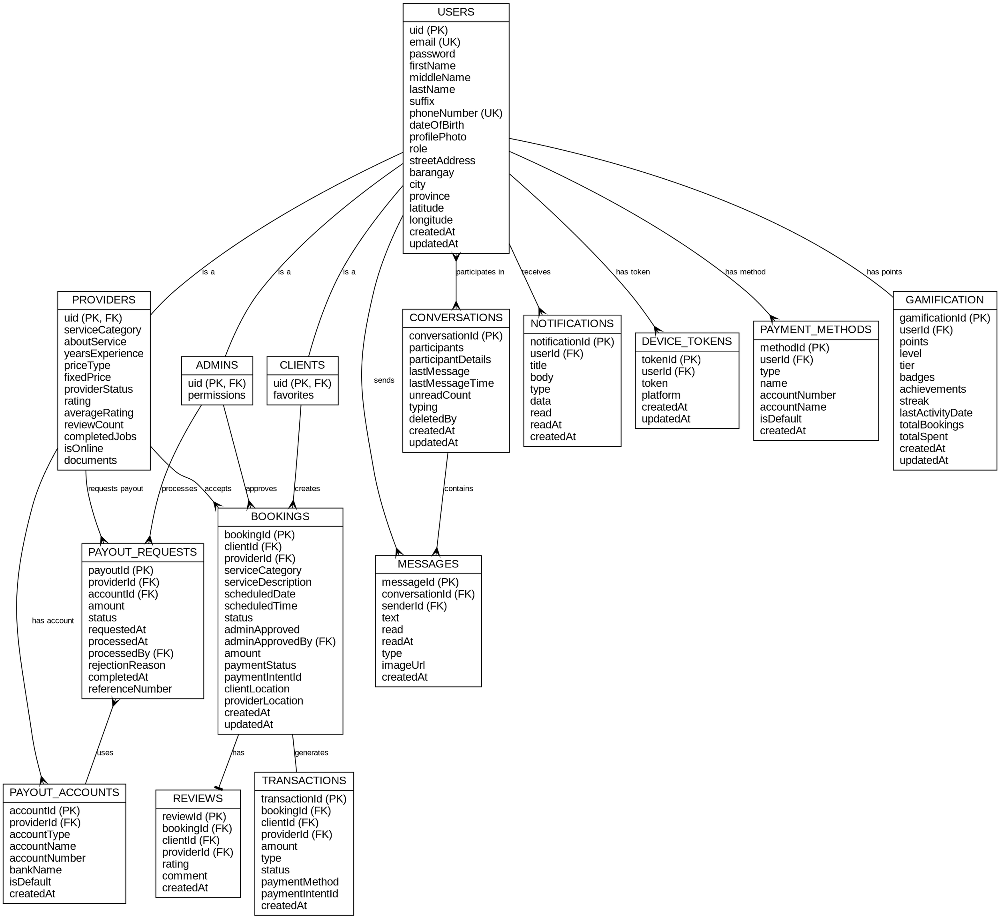

# ER Diagram - Graphviz DOT Format

Copy the code below and paste it into https://dreampuf.github.io/GraphvizOnline/ to generate the image.



## Instructions:

1. Go to https://dreampuf.github.io/GraphvizOnline/
2. Copy the entire code block above (from digraph to the closing })
3. Paste it into the editor
4. The diagram will automatically render
5. Right-click on the diagram to save as PNG or SVG

## Alternative Online Tools:

- https://edotor.net/ (Graphviz editor)
- https://viz-js.com/ (Graphviz in browser)

## Alternative: Use Graphviz locally

If you have Graphviz installed:

```bash
# Install Graphviz (Windows with Chocolatey)
choco install graphviz

# Generate diagram
dot -Tpng ER_DIAGRAM_GRAPHVIZ.md -o er_diagram.png
```
