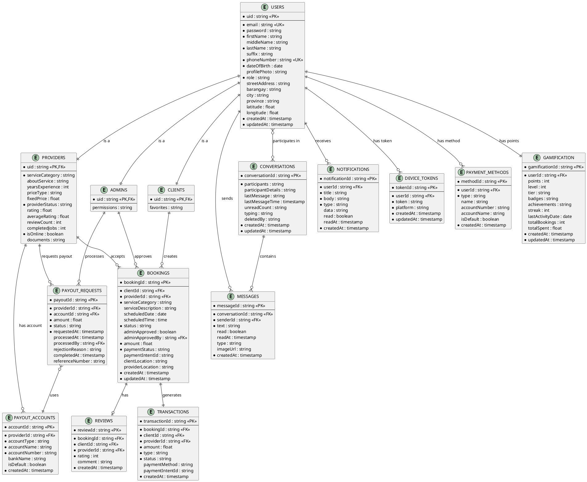

# ER Diagram - PlantUML Format

Copy the code below and paste it into http://www.plantuml.com/plantuml/uml/ to generate the image.



## Instructions:

1. Go to http://www.plantuml.com/plantuml/uml/
2. Copy the entire code block above (from @startuml to @enduml)
3. Paste it into the text area
4. Click "Submit" to generate the diagram
5. Download as PNG or SVG

## Alternative: Use PlantUML locally

If you have Java installed:

```bash
# Download PlantUML
curl -L -o plantuml.jar https://github.com/plantuml/plantuml/releases/download/v1.2023.13/plantuml-1.2023.13.jar

# Generate diagram
java -jar plantuml.jar ER_DIAGRAM_PLANTUML.md
```
